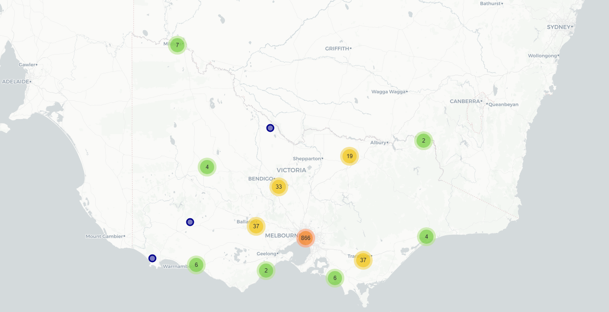

# Maps

This folder contains spatial visualisations and geographic summaries used in the Victoria Free Public Transport Initiative.

## Geographic Distribution of Survey Respondents

**Map 1.** Geographic distribution of survey respondents by residential postcode. Marker sizes represent aggregated respondent counts within each postcode area. Responses are shown at postcode level only to protect participant privacy.

The survey achieved broad geographic coverage across Victoria, with responses received from metropolitan Melbourne as well as regional and rural communities across the state.

A total of 1,028 Victorian residents participated in the survey. As expected, the largest concentration of responses was recorded in metropolitan Melbourne, reflecting the state's population distribution and the concentration of public transport services. However, substantial participation was also obtained from regional centres and rural areas, enabling perspectives from a diverse range of communities to be captured.

Responses were aggregated to postcode level for visualisation purposes. Marker sizes indicate the number of survey respondents residing within each postcode area. To protect participant privacy and comply with research ethics requirements, only aggregated postcode-level data are presented and precise residential locations are not shown.

The geographic spread of responses provides confidence that the survey captured experiences from a wide cross-section of Victorian residents during the free public transport period.

## Traffic Detection Locations

**Map 2.** Traffic detector locations used in the corridor analysis. SCATS detector sites are shown as diamonds and TIRTL detector sites are shown as circles. The map covers five monitored corridors: Eastern Freeway, Nepean Highway, Monash Freeway, Tullamarine Freeway and the West Gate corridor.

The detector locations shown in this map were used to support the traffic monitoring component of the Victoria Free Public Transport Initiative 2026. SCATS data were used for the Eastern Freeway and Nepean Highway corridors, while TIRTL data were used for the Monash, Tullamarine and West Gate corridors.

The map illustrates the spatial coverage of the traffic monitoring network used in the first phase of the study. Detector locations were selected to provide coverage across a range of commuter, airport, freight and mixed-use travel markets. The next phase of the research will aim to expand coverage by adding further detector locations along the existing corridors and incorporating additional routes where suitable data are available.

## Interactive Detector Map
An interactive version of the detector location map is available through GitHub Pages:

<a href="https://hdia.github.io/victoria_free_public_transport_2026/maps/detector_locations_map.html" target="_blank">
Open Interactive Detector Map
</a>

The interactive map allows users to zoom, pan and inspect individual detector locations used in the study. Selecting a detector displays additional information including the detector type (SCATS or TIRTL), site identifier, corridor and geographic coordinates. The map provides a detailed view of the traffic monitoring network used to support the first phase of the Victoria Free Public Transport Experiment 2026.

The current monitoring network comprises detector sites across five major Melbourne transport corridors: Eastern Freeway, Nepean Highway, Monash Freeway, Tullamarine Freeway and the West Gate corridor. Together, these locations provide coverage of commuter, airport, freight and mixed-use travel markets and form the basis of the corridor-level traffic analyses presented in this repository and the accompanying technical report.
