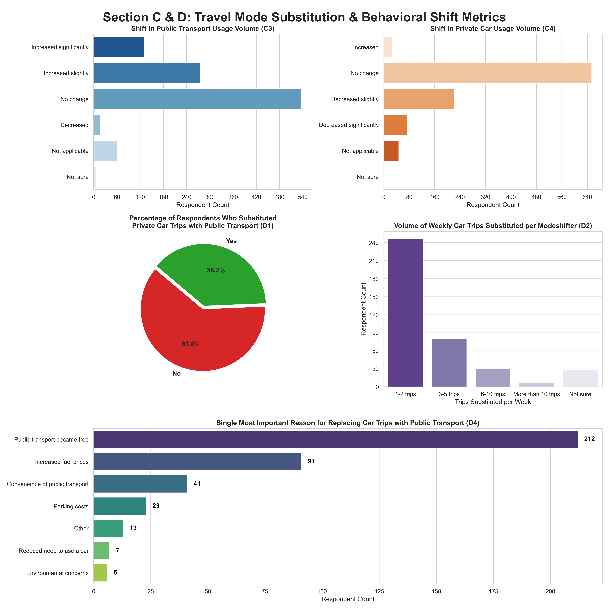
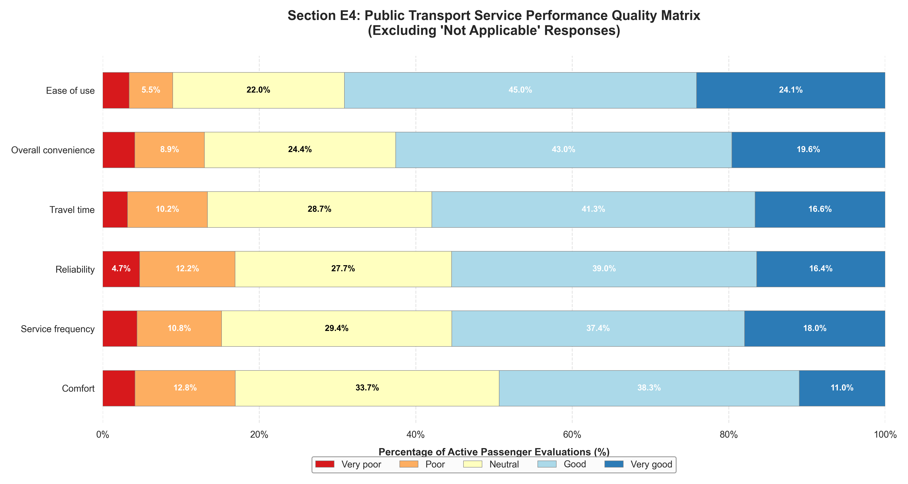
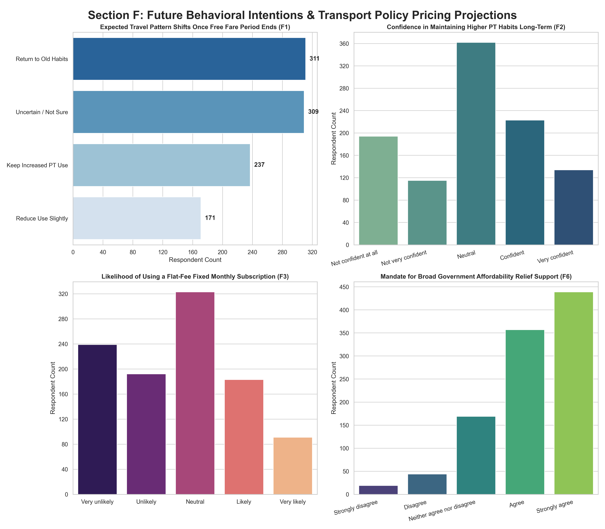
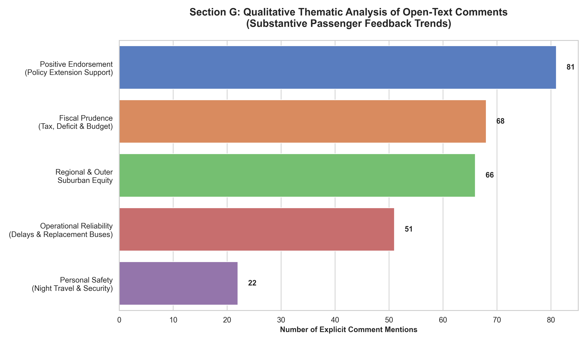

# Results

## 1. Survey Findings (Executive Summary)

| Indicator                                                        | Result |
| ---------------------------------------------------------------- | -----: |
| Increased public transport use                                   |  39.5% |
| Reduced car use                                                  |  28.8% |
| Replaced some car trips with public transport                    |  38.2% |
| Increased total travel                                           |  16.1% |
| Support for affordable public transport during economic pressure |  77.4% |

The survey results suggest the free public transport period encouraged many Victorians to experiment with public transport and reduce some car travel.

---

## 2. Survey Results

## 2.1 Mode Substitution and Behavioural Change

The survey found clear evidence of behavioural change during the free public transport period. More than one-third of respondents (38.2%) reported replacing at least some private car trips with public transport. Among those who changed behaviour, most substituted between one and five car trips per week.

The removal of fares emerged as the single most important reason for replacing car trips with public transport, followed by increased fuel prices. Convenience, parking costs and environmental concerns played smaller but still measurable roles.

The findings indicate that the policy encouraged many Victorians to experiment with public transport and substitute selected car trips, even though large-scale reductions in overall road traffic were not observed across all corridors.

**Figure R1.** Changes in public transport use, car use and mode substitution during the free public transport period.

## 2.2 Drivers of Travel Behaviour Change

_What drove changes in travel behaviour?_

Survey respondents identified multiple factors influencing their travel decisions. Increased fuel prices (258 responses) and free public transport (250 responses) emerged as the two most frequently cited drivers of behavioural change. A further 282 respondents indicated that no single factor dominated their decision-making.

Other influences included public transport convenience, travel time considerations, work and lifestyle changes, parking costs, and access to public transport services.

These findings suggest that travel behaviour during the study period was shaped by a combination of economic, transport and personal factors rather than by fare changes alone. This highlights the importance of considering broader contextual influences when evaluating the impacts of transport pricing policies.

**Figure R2.** Most important factors influencing reported travel behaviour changes during the free public transport period.

# 2.3 Public Transport Experience and Service Quality

Survey respondents generally reported positive perceptions of public transport services. Ease of use received the strongest ratings, with approximately 69% of active users rating it as good or very good. Overall convenience, travel time and reliability also received predominantly positive assessments.

However, comfort and service frequency attracted comparatively weaker ratings. Comfort recorded the lowest proportion of very good ratings, while service frequency and reliability generated the highest levels of dissatisfaction among service attributes assessed.

These findings suggest that while fare reductions encouraged greater public transport use, long-term shifts away from private vehicle travel may depend on continued improvements in service quality, reliability, comfort and network capacity.

**Figure R3.** Passenger evaluation of public transport service attributes during the free public transport period.

## 2.4 Future Travel Behaviour and Policy Implications

Survey respondents expressed mixed expectations regarding their future travel behaviour once free public transport ended. While many anticipated returning to previous travel patterns, a substantial proportion expected to maintain increased public transport use or remained uncertain about their future behaviour.

Confidence in maintaining higher levels of public transport use was moderate overall, suggesting that behavioural changes observed during the free fare period may persist for some users but are unlikely to become universal without additional incentives or service improvements.

Respondents also expressed strong support for affordability-focused transport policies. Most agreed or strongly agreed that governments should provide measures to help households manage transport costs during periods of economic pressure.

These findings support the decision to continue monitoring travel behaviour during the subsequent 50% fare reduction period, as longer-term behavioural responses may emerge gradually rather than during the initial free fare phase.

**Figure R4.** Future travel intentions and attitudes towards public transport affordability policies.

## 2.5 Qualitative Insights from Open-Text Responses

The survey included opportunities for respondents to provide open-ended comments regarding the free public transport initiative and their travel experiences. Thematic analysis revealed a mixture of supportive and critical perspectives.

The most frequently occurring theme involved positive endorsement of the initiative and support for extending affordable public transport measures. Many respondents highlighted cost-of-living benefits, increased mobility and improved access to employment, education and social activities.

However, respondents also raised concerns regarding the fiscal sustainability of fare reductions, service quality, and the uneven distribution of benefits between metropolitan and regional areas. Operational issues including delays, replacement buses, overcrowding and service reliability were also commonly discussed.

A smaller but important group of respondents highlighted personal safety concerns, particularly relating to evening travel and security at stations and stops.

The qualitative findings reinforce the broader survey results by demonstrating strong public support for affordable public transport alongside ongoing concerns about service quality, reliability and equity.

**Figure R5.** Major themes identified from qualitative analysis of respondent comments.

## 3. Traffic Analysis Results

## 3.1 Corridor Traffic Summary

| Corridor    | Average Change |
| ----------- | -------------: |
| Tullamarine |          -6.4% |
| Monash      |          -3.2% |
| Eastern     |          -2.2% |
| Nepean      |          -1.3% |
| West Gate   |          +3.1% |

Four of the five monitored corridors recorded lower traffic volumes than their matched March baseline.

---

## 3.2 Day-of-Week Traffic Heatmap

**Figure R6.** Average traffic change by corridor and day of week during Victoria's free public transport period. Green indicates lower traffic volumes relative to the March baseline, while red indicates higher traffic volumes.

The heatmap highlights substantial variation between corridors. The strongest and most consistent reductions occurred on the Tullamarine corridor, while the West Gate corridor displayed a different pattern, likely reflecting freight and logistics activity.

---

## 3.3 Policy Period Effects

| Corridor    | Launch Period | Easter | School Holidays | Post-Holiday Normal |
| ----------- | ------------: | -----: | --------------: | ------------------: |
| Eastern     |         +0.1% | -30.2% |           -9.9% |               +0.0% |
| Monash      |         +3.3% | -21.8% |           -4.6% |               -3.1% |
| Nepean      |         -1.3% | -29.0% |           -5.4% |               -0.0% |
| Tullamarine |         -0.4% | -22.5% |           -4.8% |               -7.2% |
| West Gate   |         -6.8% | -28.4% |          -17.3% |               +9.9% |

Traffic reductions were largest during Easter and school holiday periods. After those effects are removed, more modest but still measurable reductions remain on most monitored corridors, particularly Tullamarine and Monash.
