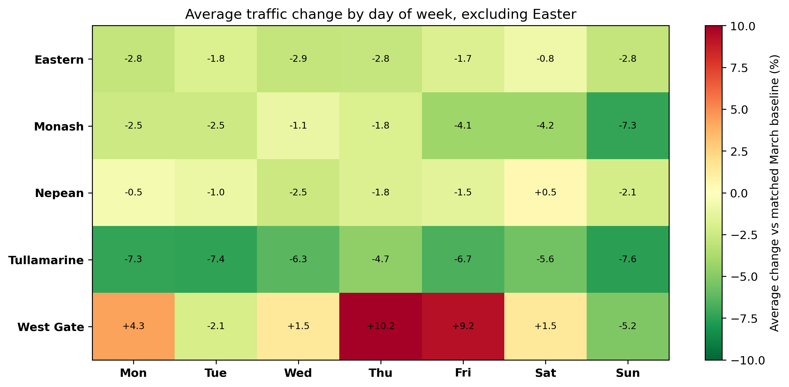
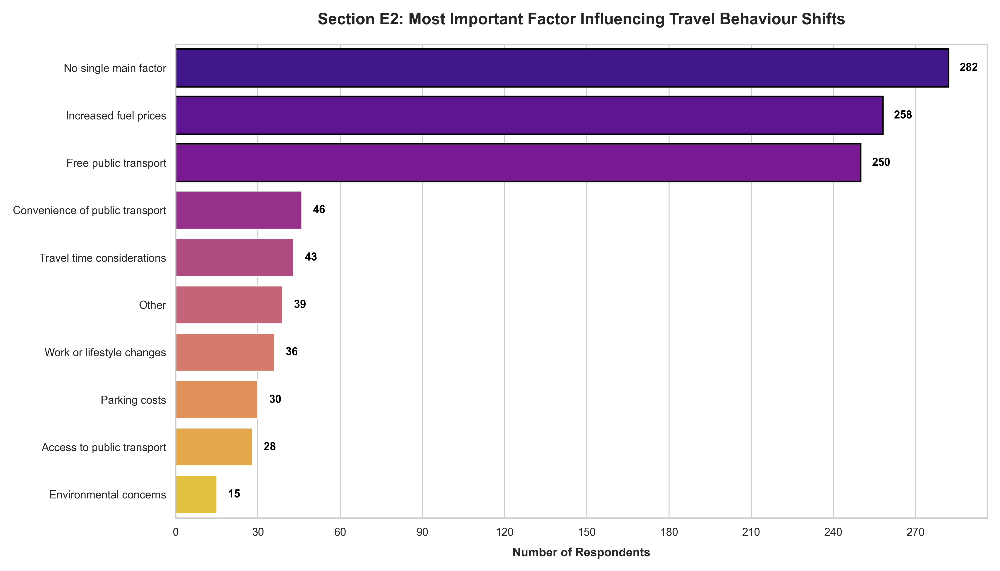

# Results

## Survey Findings

| Indicator                                                        | Result |
| ---------------------------------------------------------------- | -----: |
| Increased public transport use                                   |  39.5% |
| Reduced car use                                                  |  28.8% |
| Replaced some car trips with public transport                    |  38.2% |
| Increased total travel                                           |  16.1% |
| Support for affordable public transport during economic pressure |  77.4% |

The survey results suggest the free public transport period encouraged many Victorians to experiment with public transport and reduce some car travel.

---

## Corridor Traffic Summary

| Corridor    | Average Change |
| ----------- | -------------: |
| Tullamarine |          -6.4% |
| Monash      |          -3.2% |
| Eastern     |          -2.2% |
| Nepean      |          -1.3% |
| West Gate   |          +3.1% |

Four of the five monitored corridors recorded lower traffic volumes than their matched March baseline.

---

## Day-of-Week Traffic Heatmap

**Figure R1.** Average traffic change by corridor and day of week during Victoria's free public transport period. Green indicates lower traffic volumes relative to the March baseline, while red indicates higher traffic volumes.

The heatmap highlights substantial variation between corridors. The strongest and most consistent reductions occurred on the Tullamarine corridor, while the West Gate corridor displayed a different pattern, likely reflecting freight and logistics activity.

---

## Policy Period Effects

| Corridor    | Launch Period | Easter | School Holidays | Post-Holiday Normal |
| ----------- | ------------: | -----: | --------------: | ------------------: |
| Eastern     |         +0.1% | -30.2% |           -9.9% |               +0.0% |
| Monash      |         +3.3% | -21.8% |           -4.6% |               -3.1% |
| Nepean      |         -1.3% | -29.0% |           -5.4% |               -0.0% |
| Tullamarine |         -0.4% | -22.5% |           -4.8% |               -7.2% |
| West Gate   |         -6.8% | -28.4% |          -17.3% |               +9.9% |

Traffic reductions were largest during Easter and school holiday periods. After those effects are removed, more modest but still measurable reductions remain on most monitored corridors, particularly Tullamarine and Monash.

## Drivers of Travel Behaviour Change

**Figure R2.** Most important factors influencing reported travel behaviour changes during the free public transport period.
