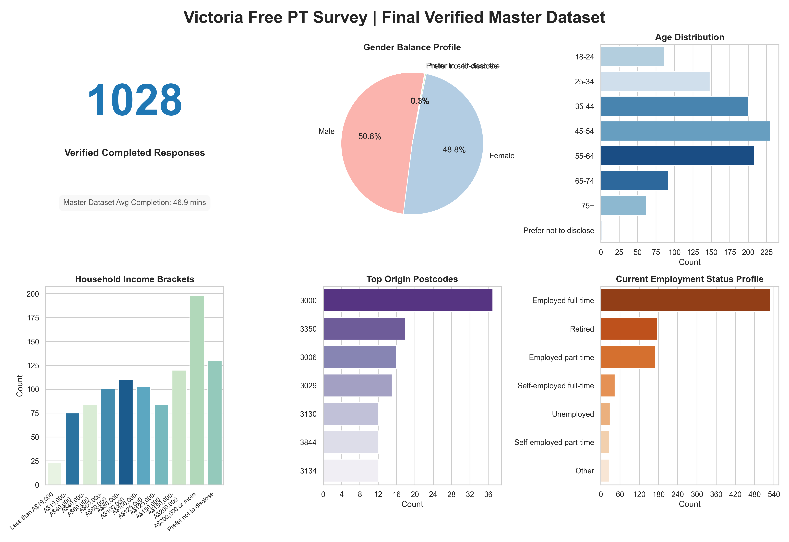

# Survey Respondent Profile

## Overview

The survey collected responses from 1,028 Victorian residents during the free public transport period (April-May 2026).

The figure below summarises key demographic characteristics of the final verified survey sample, including age, gender, employment status, household income and geographic distribution.

**Figure S1.** Demographic profile of the final verified survey sample (n = 1,028).

The sample achieved a broad demographic spread across age groups, employment categories, income brackets and residential locations. The largest age cohorts were 35-44 and 45-54 years, while the gender distribution was close to balanced. Responses were received from both metropolitan Melbourne and regional Victoria.
